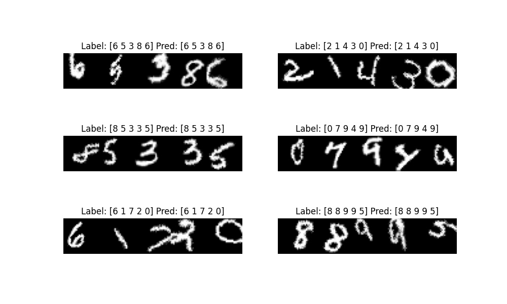
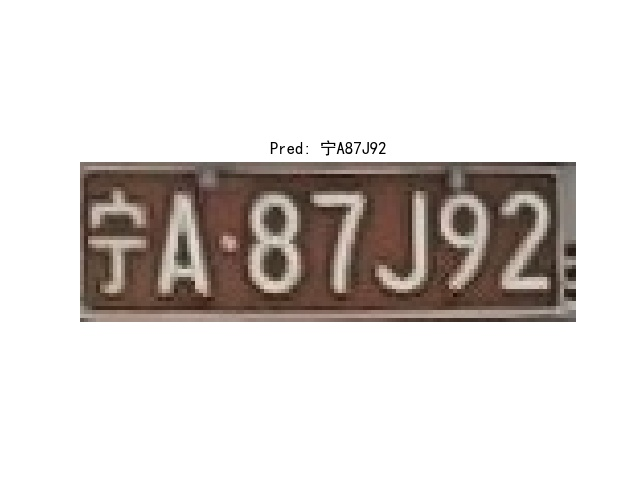

<!-- <div align="right">
  Language:
    🇺🇸
  <a title="Chinese" href="./README.zh-CN.md">🇨🇳</a>
</div> -->

<div align="center"><a title="" href="https://github.com/zjykzj/crnn-ctc"></a></div>

<p align="center">
  «crnn-ctc» implemented CRNN+CTC
<br>
<br>
  <a href="https://github.com/RichardLitt/standard-readme"></a>
  <a href="https://conventionalcommits.org"></a>
  <a href="http://commitizen.github.io/cz-cli/"></a>
</p>

## Table of Contents

- [Table of Contents](#table-of-contents)
- [Latest News](#latest-news)
- [Background](#background)
- [Installation](#installation)
- [Usage](#usage)
  - [Train](#train)
  - [Eval](#eval)
  - [Predict](#predict)
- [Maintainers](#maintainers)
- [Thanks](#thanks)
- [Contributing](#contributing)
- [License](#license)

## Latest News

* ***[2023/10/11][v0.2.0](https://github.com/zjykzj/crnn-ctc/releases/tag/v0.2.0). Support training/evaluation/prediction of CRNN+CTC based on license plate.***
* ***[2023/10/10][v0.1.0](https://github.com/zjykzj/crnn-ctc/releases/tag/v0.1.0). Support training/evaluation/prediction of CRNN+CTC based on EMNIST digital characters.***

## Background

This warehouse aims to better understand and apply CRNN+CTC, and currently achieves digital recognition and license plate recognition

## Installation

```shell
pip install -r requirements.txt
```

## Usage

### Train

```shell
# EMNIST
$ python -m torch.distributed.run --nproc_per_node 4 --master_port 32512 train_emist.py --device 0,1,2,3 ../datasets/EMNIST/ runs/emnist_ddp/
# Plate
$ python -m torch.distributed.run --nproc_per_node 4 --master_port 32512 train_plate.py --device 0,1,2,3 ../datasets/git_plate/CCPD_CRPD_OTHER_ALL/ ../datasets/git_plate/val_verify/ runs/plate_ddp/
```

### Eval

```shell
# EMNIST
$ python eval_emnist.py runs/emnist_ddp/crnn-emnist-e100.pth ../datasets/EMNIST/
args: Namespace(pretrained='runs/emnist_ddp/crnn-emnist-e100.pth', val_root='../datasets/EMNIST/')
Loading CRNN pretrained: runs/emnist_ddp/crnn-emnist-e100.pth
Batch:62 ACC:100.000: 100%|██████████████████████████████████████████████████████████████████████████████████████████████████████████████████████████████| 63/63 [00:02<00:00, 30.82it/s]
ACC:95.100
# Plate
$ python eval_plate.py runs/plate_ddp/crnn-plate-e100.pth ../datasets/git_plate/val_verify/
args: Namespace(pretrained='runs/plate_ddp/crnn-plate-e100.pth', val_root='../datasets/git_plate/val_verify/')
Loading CRNN pretrained: runs/plate_ddp/crnn-plate-e100.pth
Load test data: 2014
Batch:62 ACC:96.667: 100%|███████████████████████████████████████████████████████████████████████████████████████████████████████████████████████████████| 63/63 [00:02<00:00, 22.51it/s]
ACC:97.319
```

### Predict

```shell
$ python predict_emnist.py runs/emnist_ddp/crnn-emnist-e100.pth ../datasets/EMNIST/ runs/
args: Namespace(pretrained='runs/emnist_ddp/crnn-emnist-e100.pth', save_dir='runs/', val_root='../datasets/EMNIST/')
Loading CRNN pretrained: runs/emnist_ddp/crnn-emnist-e100.pth
Label: [6 5 3 8 6] Pred: [6 5 3 8 6]
Label: [2 1 4 3 0] Pred: [2 1 4 3 0]
Label: [8 5 3 3 5] Pred: [8 5 3 3 5]
Label: [0 7 9 4 9] Pred: [0 7 9 4 9]
Label: [6 1 7 2 0] Pred: [6 1 7 2 0]
Label: [8 8 9 9 5] Pred: [8 8 9 9 5]
```



```shell
$ python predict_plate.py runs/plate_ddp/crnn-plate-e100.pth ./assets/plate/宁A87J92_0.jpg runs/
args: Namespace(image_path='./assets/plate/宁A87J92_0.jpg', pretrained='runs/plate_ddp/crnn-plate-e100.pth', save_dir='runs/')
Loading CRNN pretrained: runs/plate_ddp/crnn-plate-e100.pth
Pred: 宁A87J92
$ python predict_plate.py runs/plate_ddp/crnn-plate-e100.pth ./assets/plate/川A3X7J1_0.jpg runs/
args: Namespace(image_path='./assets/plate/川A3X7J1_0.jpg', pretrained='runs/plate_ddp/crnn-plate-e100.pth', save_dir='runs/')
Loading CRNN pretrained: runs/plate_ddp/crnn-plate-e100.pth
Pred: 川A3X7J1
```

<p align="left">  </p>

## Maintainers

* zhujian - *Initial work* - [zjykzj](https://github.com/zjykzj)

## Thanks

* [rinabuoy/crnn-ctc-loss-pytorch](https://github.com/rinabuoy/crnn-ctc-loss-pytorch.git)
* [we0091234/crnn_plate_recognition](https://github.com/we0091234/crnn_plate_recognition.git)
* [zjykzj/LPDet](https://github.com/zjykzj/LPDet)

## Contributing

Anyone's participation is welcome! Open an [issue](https://github.com/zjykzj/crnn-ctc/issues) or submit PRs.

Small note:

* Git submission specifications should be complied
  with [Conventional Commits](https://www.conventionalcommits.org/en/v1.0.0-beta.4/)
* If versioned, please conform to the [Semantic Versioning 2.0.0](https://semver.org) specification
* If editing the README, please conform to the [standard-readme](https://github.com/RichardLitt/standard-readme)
  specification.

## License

[Apache License 2.0](LICENSE) © 2023 zjykzj