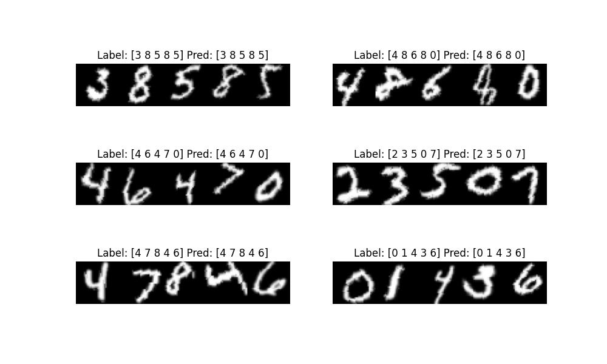
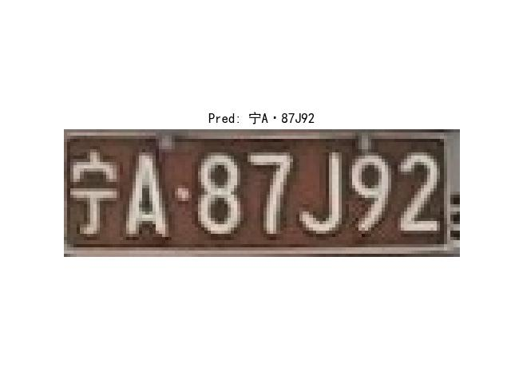
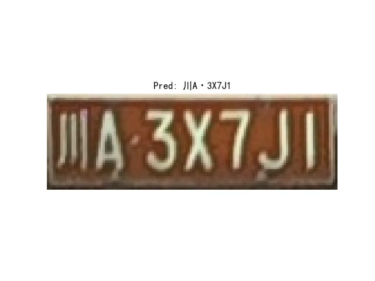

<!-- <div align="right">
  Language:
    🇺🇸
  <a title="Chinese" href="./README.zh-CN.md">🇨🇳</a>
</div> -->

<div align="center"><a title="" href="https://github.com/zjykzj/crnn-ctc"></a></div>

<p align="center">
  «crnn-ctc» implemented CRNN+CTC
<br>
<br>
  <a href="https://github.com/RichardLitt/standard-readme"></a>
  <a href="https://conventionalcommits.org"></a>
  <a href="http://commitizen.github.io/cz-cli/"></a>
</p>

ONLINE DEMO：[LICENSE PLATE RECOGNITION](https://blog.zjykzj.cn/gradio/plate_recog/)

|   **Model**   | **ARCH** | **Input Shape** | **GFLOPs** | **Model Size (MB)** | **EMNIST Accuracy (%)** | **Training Data** | **Testing Data** |
|:-------------:|:--------:|:---------------:|:----------:|:-------------------:|:-----------------------:|:-----------------:|:----------------:|
|   **CRNN**    | CONV+GRU |  (1, 32, 160)   |    2.2     |         31          |         98.570          |      100,000      |      5,000       |
| **CRNN_Tiny** | CONV+GRU |  (1, 32, 160)   |    0.1     |         1.7         |         98.306          |      100,000      |      5,000       |

|      **Model**       | **ARCH** | **Input Shape** | **GFLOPs** | **Model Size (MB)** | **ChineseLicensePlate Accuracy (%)** | **Training Data** | **Testing Data** |
|:--------------------:|:--------:|:---------------:|:----------:|:-------------------:|:------------------------------------:|:-----------------:|:----------------:|
|       **CRNN**       | CONV+GRU |  (3, 48, 168)   |    4.0     |         58          |                82.147                |      269,621      |     149,002      |
|    **CRNN_Tiny**     | CONV+GRU |  (3, 48, 168)   |    0.3     |         4.0         |                76.590                |      269,621      |     149,002      |
|    **LPRNetPlus**    |   CONV   |   (3, 24, 94)   |    0.5     |         2.3         |                63.546                |      269,621      |     149,002      |
|      **LPRNet**      |   CONV   |   (3, 24, 94)   |    0.3     |         1.9         |                60.105                |      269,621      |     149,002      |
| **LPRNetPlus+STNet** |   CONV   |   (3, 24, 94)   |    0.5     |         2.5         |                72.130                |      269,621      |     149,002      |
|   **LPRNet+STNet**   |   CONV   |   (3, 24, 94)   |    0.3     |         2.2         |                72.261                |      269,621      |     149,002      |

For each sub-dataset, the model performance as follows:

|      **Model**       | **CCPD2019-Test Accuracy (%)** | **Testing Data** | **CCPD2020-Test Accuracy (%)** | **Testing Data** |
|:--------------------:|:------------------------------:|:----------------:|:------------------------------:|:----------------:|
|       **CRNN**       |             81.512             |     141,982      |             93.787             |      5,006       |
|    **CRNN_Tiny**     |             75.729             |     141,982      |             92.829             |      5,006       |
|    **LPRNetPlus**    |             62.184             |     141,982      |             89.373             |      5,006       |
|      **LPRNet**      |             59.597             |     141,982      |             89.153             |      5,006       |
| **LPRNetPlus+STNet** |             72.125             |     141,982      |             90.611             |      5,006       |
|   **LPRNet+STNet**   |             71.291             |     141,982      |             89.832             |      5,006       |

## Table of Contents

- [Table of Contents](#table-of-contents)
- [News🚀🚀🚀](#news)
- [Background](#background)
- [Installation](#installation)
- [Usage](#usage)
  - [Train](#train)
  - [Eval](#eval)
  - [Predict](#predict)
- [Maintainers](#maintainers)
- [Thanks](#thanks)
- [Contributing](#contributing)
- [License](#license)

## News🚀🚀🚀

| Version                                                          | Release Date | Major Updates                                                                                                                                           |
|------------------------------------------------------------------|--------------|---------------------------------------------------------------------------------------------------------------------------------------------------------|
| [v1.3.0](https://github.com/zjykzj/crnn-ctc/releases/tag/v1.3.0) | 2024/09/21   | Add **STNet** module to LPRNet/LPRNetPlus and update the training/evaluation/prediction results on the CCPD dataset.                                    |
| [v1.2.0](https://github.com/zjykzj/crnn-ctc/releases/tag/v1.2.0) | 2024/09/17   | Create a new **LPRNet/LPRNetPlus** model and update the training/evaluation/prediction results on the CCPD dataset.                                     |
| [v1.1.0](https://github.com/zjykzj/crnn-ctc/releases/tag/v1.1.0) | 2024/08/17   | Update EVAL/PREDICT implementation, support Pytorch format model conversion to ONNX, and finally provide online demo based on Gradio.                   |
| [v1.0.0](https://github.com/zjykzj/crnn-ctc/releases/tag/v1.0.0) | 2024/08/04   | Optimize the CRNN architecture while achieving super lightweight **CRNN_Tiny**. <br>In addition, all training scripts support mixed precision training. |
| [v0.3.0](https://github.com/zjykzj/crnn-ctc/releases/tag/v0.3.0) | 2024/08/03   | Implement models **CRNN_LSTM** and **CRNN_GRU** on datasets EMNIST and ChineseLicensePlate.                                                             |
| [v0.2.0](https://github.com/zjykzj/crnn-ctc/releases/tag/v0.2.0) | 2023/10/11   | Support training/evaluation/prediction of CRNN+CTC based on license plate.                                                                              |
| [v0.1.0](https://github.com/zjykzj/crnn-ctc/releases/tag/v0.1.0) | 2023/10/10   | Support training/evaluation/prediction of CRNN+CTC based on EMNIST digital characters.                                                                  |

## Background

This warehouse aims to better understand and apply CRNN+CTC, and currently achieves digital recognition and license
plate recognition

## Installation

```shell
$ pip install -r requirements.txt
```

Or use docker container

```shell
$ docker run -it --runtime nvidia --gpus=all --shm-size=16g -v /etc/localtime:/etc/localtime -v $(pwd):/workdir --workdir=/workdir --name crnn-ctc ultralytics/yolov5:latest
```

## Usage

### Train

* ChineseLicensePlate: [Baidu Drive](https://pan.baidu.com/s/1fQh0E9c6Z4satvrEthKevg)(ad7l)

```shell
# EMNIST
$ python3 train_emnist.py ../datasets/emnist/ ./runs/crnn-emnist-b512/ --batch-size 512 --device 0 --not-tiny
# Plate
$ python3 train_plate.py ../datasets/chinese_license_plate/recog/ ./runs/crnn-plate-b512/ --batch-size 512 --device 0 --not-tiny
```

### Eval

```shell
# EMNIST
$ CUDA_VISIBLE_DEVICES=0 python eval_emnist.py crnn-emnist.pth ../datasets/emnist/ --not-tiny
args: Namespace(not_tiny=True, pretrained='crnn-emnist.pth', use_lstm=False, val_root='../datasets/emnist/')
Loading CRNN pretrained: crnn-emnist.pth
crnn-emnist summary: 29 layers, 7924363 parameters, 7924363 gradients, 2.2 GFLOPs
Batch:49999 ACC:100.000: 100%|████████████████████████████████████████████████████████| 50000/50000 [03:47<00:00, 219.75it/s]
ACC:98.570
# Plate
$ CUDA_VISIBLE_DEVICES=0 python3 eval_plate.py crnn-plate.pth ../datasets/chinese_license_plate/recog/ --not-tiny
args: Namespace(add_stnet=False, not_tiny=True, only_ccpd2019=False, only_ccpd2020=False, only_others=False, pretrained='crnn-plate.pth', use_lprnet=False, use_lstm=False, use_origin_block=False, val_root='../datasets/chinese_license_plate/recog/')
Loading CRNN pretrained: crnn-plate.pth
crnn-plate summary: 29 layers, 15083854 parameters, 15083854 gradients, 4.0 GFLOPs
Load test data: 149002
Batch:4656 ACC:100.000: 100%|████████████████████████████████████████████████████████████| 4657/4657 [00:52<00:00, 89.13it/s]
ACC:82.147
```

### Predict

```shell
$ CUDA_VISIBLE_DEVICES=0 python predict_emnist.py crnn-emnist.pth ../datasets/emnist/ ./runs/predict/emnist/ --not-tiny
args: Namespace(not_tiny=True, pretrained='crnn-emnist.pth', save_dir='./runs/predict/emnist/', use_lstm=False, val_root='../datasets/emnist/')
Loading CRNN pretrained: crnn-emnist.pth
crnn-emnist summary: 29 layers, 7924363 parameters, 7924363 gradients, 2.2 GFLOPs
Label: [0 4 2 4 7] Pred: [0 4 2 4 7]
Label: [2 0 6 5 4] Pred: [2 0 6 5 4]
Label: [7 3 9 9 5] Pred: [7 3 9 9 5]
Label: [9 6 6 0 9] Pred: [9 6 6 0 9]
Label: [2 3 0 7 6] Pred: [2 3 0 7 6]
Label: [6 5 9 5 2] Pred: [6 5 9 5 2]
```



```shell
$ CUDA_VISIBLE_DEVICES=0 python predict_plate.py crnn-plate.pth ./assets/plate/宁A87J92_0.jpg runs/predict/plate/ --not-tiny
args: Namespace(add_stnet=False, image_path='./assets/plate/宁A87J92_0.jpg', not_tiny=True, pretrained='crnn-plate.pth', save_dir='runs/predict/plate/', use_lprnet=False, use_lstm=False, use_origin_block=False)
Loading CRNN pretrained: crnn-plate.pth
crnn-plate summary: 29 layers, 15083854 parameters, 15083854 gradients, 4.0 GFLOPs
Pred: 宁A·87J92 - Predict time: 5.4 ms
Save to runs/predict/plate/plate_宁A87J92_0.jpg
$ CUDA_VISIBLE_DEVICES=0 python predict_plate.py crnn-plate.pth ./assets/plate/川A3X7J1_0.jpg runs/predict/plate/ --not-tiny
args: Namespace(add_stnet=False, image_path='./assets/plate/川A3X7J1_0.jpg', not_tiny=True, pretrained='crnn-plate.pth', save_dir='runs/predict/plate/', use_lprnet=False, use_lstm=False, use_origin_block=False)
Loading CRNN pretrained: crnn-plate.pth
crnn-plate summary: 29 layers, 15083854 parameters, 15083854 gradients, 4.0 GFLOPs
Pred: 川A·3X7J1 - Predict time: 4.7 ms
Save to runs/predict/plate/plate_川A3X7J1_0.jpg
```

<p align="left">  </p>

## Maintainers

* zhujian - *Initial work* - [zjykzj](https://github.com/zjykzj)

## Thanks

* [rinabuoy/crnn-ctc-loss-pytorch](https://github.com/rinabuoy/crnn-ctc-loss-pytorch.git)
* [we0091234/crnn_plate_recognition](https://github.com/we0091234/crnn_plate_recognition.git)
* [sirius-ai/LPRNet_Pytorch](https://github.com/sirius-ai/LPRNet_Pytorch)
* [CA-USTC/License_Plate_Recognition_pytorch](https://github.com/CA-USTC/License_Plate_Recognition_pytorch)
* [zjykzj/LPDet](https://github.com/zjykzj/LPDet)

## Contributing

Anyone's participation is welcome! Open an [issue](https://github.com/zjykzj/crnn-ctc/issues) or submit PRs.

Small note:

* Git submission specifications should be complied
  with [Conventional Commits](https://www.conventionalcommits.org/en/v1.0.0-beta.4/)
* If versioned, please conform to the [Semantic Versioning 2.0.0](https://semver.org) specification
* If editing the README, please conform to the [standard-readme](https://github.com/RichardLitt/standard-readme)
  specification.

## License

[Apache License 2.0](LICENSE) © 2023 zjykzj